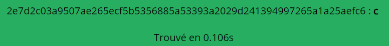

# Cyberlock 3000

이거는 끝나고 풀었다..  
md5decrypt.net에 sha256 복호화를 돌리니 안 나와서 포기했다  
근데 다른 분들 라업보니 내가 하던게 맞았다..  
md5decrypt.net는 소문자로 써야된다..메모메모  
풀었으면 5등인데 아숩..
<br/>

radare2로 열고 pdf @ main을 해준다
```
[0x004011c0]> pdf @ main
            ; DATA XREF from entry0 @ 0x4011dd
┌ 214: int main (int argc, char **argv, char **envp);
│           ; var int64_t var_34h @ rbp-0x34
│           ; var int64_t var_30h @ rbp-0x30
│           ; var uint32_t var_2ch @ rbp-0x2c
│           ; var int64_t var_28h @ rbp-0x28
│           ; var file*var_20h @ rbp-0x20
│           ; var char *filename @ rbp-0x18
│           ; var int64_t var_10h @ rbp-0x10
│           ; var uint32_t var_8h @ rbp-0x8
│           ; var int64_t var_4h @ rbp-0x4
│           0x004018b0      55             push rbp
│           0x004018b1      4889e5         mov rbp, rsp
│           0x004018b4      4883ec40       sub rsp, 0x40
│           0x004018b8      c745fc000000.  mov dword [var_4h], 0
│           0x004018bf      e8cc000000     call fcn.00401990
│           0x004018c4      e847020000     call fcn.00401b10
│           0x004018c9      8945f8         mov dword [var_8h], eax
│           0x004018cc      837df803       cmp dword [var_8h], 3
│       ┌─< 0x004018d0      0f8594000000   jne 0x40196a
│       │   0x004018d6      48c745f00000.  mov qword [var_10h], 0
│       │   0x004018de      48b8fd264000.  movabs rax, str.tmp_masterkey.in ; 0x4026fd ; "/tmp/masterkey.in"
│       │   0x004018e8      488945e8       mov qword [filename], rax
│       │   0x004018ec      488b7de8       mov rdi, qword [filename]   ; const char *filename
│       │   0x004018f0      48be0f274000.  movabs rsi, 0x40270f        ; "r" ; const char *mode
│       │   0x004018fa      e881f7ffff     call sym.imp.fopen          ; file*fopen(const char *filename, const char *mode)
│       │   0x004018ff      488945e0       mov qword [var_20h], rax
│       │   0x00401903      48837de000     cmp qword [var_20h], 0
│      ┌──< 0x00401908      0f8447000000   je 0x401955
│      ││   0x0040190e      31c0           xor eax, eax
│      ││   0x00401910      89c2           mov edx, eax
│      ││   0x00401912      488b7de8       mov rdi, qword [filename]
│      ││   0x00401916      488d75d8       lea rsi, [var_28h]
│      ││   0x0040191a      488d4df0       lea rcx, [var_10h]
│      ││   0x0040191e      e84df8ffff     call sym.imp.g_file_get_contents
│      ││   0x00401923      8945d4         mov dword [var_2ch], eax
│      ││   0x00401926      837dd400       cmp dword [var_2ch], 0
│     ┌───< 0x0040192a      0f8420000000   je 0x401950
│     │││   0x00401930      48bf11274000.  movabs rdi, str.i__Procesing_input_code... ; 0x402711 ; "[i] Procesing input code...\n" ; const char *format
│     │││   0x0040193a      b000           mov al, 0
│     │││   0x0040193c      e8fff6ffff     call sym.imp.printf         ; int printf(const char *format)
│     │││   0x00401941      488b7dd8       mov rdi, qword [var_28h]    ; int64_t arg1
│     │││   0x00401945      8b75f8         mov esi, dword [var_8h]     ; int64_t arg2
│     │││   0x00401948      8945d0         mov dword [var_30h], eax
│     │││   0x0040194b      e880fbffff     call fcn.004014d0
│     │││   ; CODE XREF from main @ 0x40192a
│    ┌└───> 0x00401950      e910000000     jmp 0x401965
│    │ ││   ; CODE XREF from main @ 0x401908
│    │ └──> 0x00401955      488b3c25f040.  mov rdi, qword [0x4040f0]   ; [0x4040f0:8]=0x402004 str.2E7D2C03A9507AE265ECF5B5356885A53393A2029D241394997265A1A25AEFC6454349E422F05297191EAD13E21D3DB520E5ABEF52055E4964B82FB213F593A1 ; int64_t arg1
│    │  │   0x0040195d      8b75f8         mov esi, dword [var_8h]     ; int64_t arg2
│    │  │   0x00401960      e86bfbffff     call fcn.004014d0
│    │  │   ; CODE XREF from main @ 0x401950
│    └─┌──< 0x00401965      e914000000     jmp 0x40197e
│      ││   ; CODE XREF from main @ 0x4018d0
│      │└─> 0x0040196a      48bf2e274000.  movabs rdi, str.Oh..._we_forgot_to_tell_you_that_this_secure_lock_can_only_be_unlocked_once_per_hour___ha_ha_ha__Come_back_at_3_minutes_past_the_hour.__Exiting... ; 0x40272e ; "[!] Oh... we forgot to tell you that this secure lock can only be unlocked once per hour - ha ha ha! Come back at 3 minutes past the hour.\nExiting...\n" ; const char *format
│      │    0x00401974      b000           mov al, 0
│      │    0x00401976      e8c5f6ffff     call sym.imp.printf         ; int printf(const char *format)
│      │    0x0040197b      8945cc         mov dword [var_34h], eax
│      │    ; CODE XREF from main @ 0x401965
│      └──> 0x0040197e      31c0           xor eax, eax
│           0x00401980      4883c440       add rsp, 0x40
│           0x00401984      5d             pop rbp
└           0x00401985      c3             ret
```
<br/>

아래 부분을 보면 fcn.00401b10 함수의 리턴 값이 3이어야한다
```
│           0x004018c4      e847020000     call fcn.00401b10
│           0x004018c9      8945f8         mov dword [var_8h], eax
│           0x004018cc      837df803       cmp dword [var_8h], 3
│       ┌─< 0x004018d0      0f8594000000   jne 0x40196a
```
걍 깔끔하게 패치해준다
```
# cp Cyberlock patched
# r2 -w patched
[0x004011c0]>  wx 0x90 @ 0x00401b39
[0x004011c0]>  wa mov eax, 3 @ 0x00401b3a
[0x004011c0]>  exit
```
다시 메인을 보자
```
│       │   0x004018d6      48c745f00000.  mov qword [var_10h], 0
│       │   0x004018de      48b8fd264000.  movabs rax, str.tmp_masterkey.in ; 0x4026fd ; "/tmp/masterkey.in"
│       │   0x004018e8      488945e8       mov qword [filename], rax
│       │   0x004018ec      488b7de8       mov rdi, qword [filename]   ; const char *filename
│       │   0x004018f0      48be0f274000.  movabs rsi, 0x40270f        ; "r" ; const char *mode
│       │   0x004018fa      e881f7ffff     call sym.imp.fopen          ; file*fopen(const char *filename, const char *mode)
│       │   0x004018ff      488945e0       mov qword [var_20h], rax
│       │   0x00401903      48837de000     cmp qword [var_20h], 0
│      ┌──< 0x00401908      0f8447000000   je 0x401955
│      ││   0x0040190e      31c0           xor eax, eax
│      ││   0x00401910      89c2           mov edx, eax
│      ││   0x00401912      488b7de8       mov rdi, qword [filename]
│      ││   0x00401916      488d75d8       lea rsi, [var_28h]
│      ││   0x0040191a      488d4df0       lea rcx, [var_10h]
│      ││   0x0040191e      e84df8ffff     call sym.imp.g_file_get_contents
│      ││   0x00401923      8945d4         mov dword [var_2ch], eax
│      ││   0x00401926      837dd400       cmp dword [var_2ch], 0
│     ┌───< 0x0040192a      0f8420000000   je 0x401950
│     │││   0x00401930      48bf11274000.  movabs rdi, str.i__Procesing_input_code... ; 0x402711 ; "[i] Procesing input code...\n" ; const char *format
│     │││   0x0040193a      b000           mov al, 0
│     │││   0x0040193c      e8fff6ffff     call sym.imp.printf         ; int printf(const char *format)
│     │││   0x00401941      488b7dd8       mov rdi, qword [var_28h]    ; int64_t arg1
│     │││   0x00401945      8b75f8         mov esi, dword [var_8h]     ; int64_t arg2
│     │││   0x00401948      8945d0         mov dword [var_30h], eax
│     │││   0x0040194b      e880fbffff     call fcn.004014d0
│     │││   ; CODE XREF from main @ 0x40192a
│    ┌└───> 0x00401950      e910000000     jmp 0x401965
│    │ ││   ; CODE XREF from main @ 0x401908
│    │ └──> 0x00401955      488b3c25f040.  mov rdi, qword [0x4040f0]   ; [0x4040f0:8]=0x402004 str.2E7D2C03A9507AE265ECF5B5356885A53393A2029D241394997265A1A25AEFC6454349E422F05297191EAD13E21D3DB520E5ABEF52055E4964B82FB213F593A1 ; int64_t arg1
│    │  │   0x0040195d      8b75f8         mov esi, dword [var_8h]     ; int64_t arg2
│    │  │   0x00401960      e86bfbffff     call fcn.004014d0
```
/tmp/masterkey.in 파일이 있으면 그 파일의 내용과 3을 인자로 fcn.004014d0를 실행한다  
없으면 0x4040f0의 내용과 3을 인자로 fcn.004014d0를 실행한다  
ex) 3이 인자인 이유는 var_8h은 3이기 때문이다
<br/>

그러면 fcn.004014d0 함수를 보겠다
```
[0x004011c0]> pdf @ fcn.004014d0
            ; CALL XREFS from main @ 0x40194b, 0x401960
┌ 986: fcn.004014d0 (int64_t arg1, int64_t arg2);
│           ; var int64_t var_78ch @ rbp-0x78c
│           ; var int64_t var_788h @ rbp-0x788
│           ; var int64_t var_784h @ rbp-0x784
│           ; var int64_t var_780h @ rbp-0x780
│           ; var int64_t var_77ch @ rbp-0x77c
│           ; var char *var_778h @ rbp-0x778
│           ; var int64_t var_76ch @ rbp-0x76c
│           ; var size_t *var_768h @ rbp-0x768
│           ; var char *var_760h @ rbp-0x760
│           ; var char *var_758h @ rbp-0x758
│           ; var char *var_750h @ rbp-0x750
│           ; var int64_t var_744h @ rbp-0x744
│           ; var char *var_740h @ rbp-0x740
│           ; var char *var_738h @ rbp-0x738
│           ; var char *var_730h @ rbp-0x730
│           ; var char *s1 @ rbp-0x728
│           ; var int64_t var_720h @ rbp-0x720
│           ; var uint32_t var_71ch @ rbp-0x71c
│           ; var char **var_718h @ rbp-0x718
│           ; var int64_t var_710h @ rbp-0x710
│           ; var char *s2 @ rbp-0x703
│           ; var char *dest @ rbp-0x700
│           ; var char *s @ rbp-0x680
│           ; var uint32_t var_74h @ rbp-0x74
│           ; var uint32_t var_70h @ rbp-0x70
│           ; var char *var_64h @ rbp-0x64
│           ; var char *src @ rbp-0x60
│           ; var int64_t var_18h @ rbp-0x18
│           ; var int64_t var_ch @ rbp-0xc
│           ; var int64_t var_8h @ rbp-0x8
│           ; arg int64_t arg1 @ rdi
│           ; arg int64_t arg2 @ rsi
│           0x004014d0      55             push rbp
│           0x004014d1      4889e5         mov rbp, rsp
│           0x004014d4      4881ec900700.  sub rsp, 0x790
│           0x004014db      31c0           xor eax, eax
│           0x004014dd      b901060000     mov ecx, 0x601              ; 1537
│           0x004014e2      89ca           mov edx, ecx                ; size_t n
│           0x004014e4      48897df8       mov qword [var_8h], rdi     ; arg1
│           0x004014e8      8975f4         mov dword [var_ch], esi     ; arg2
│           0x004014eb      48c745e84000.  mov qword [var_18h], 0x40   ; '@' ; 64
│           0x004014f3      c7459c010000.  mov dword [var_64h], 1
│           0x004014fa      48c745900000.  mov qword [var_70h], 0
│           0x00401502      c7458c000000.  mov dword [var_74h], 0
│           0x00401509      488dbd80f9ff.  lea rdi, [s]                ; void *s
│           0x00401510      89c6           mov esi, eax                ; int c
│           0x00401512      e839fbffff     call sym.imp.memset         ; void *memset(void *s, int c, size_t n)
│           ; CODE XREF from fcn.004014d0 @ 0x4017f6
│       ┌─> 0x00401517      488b45f8       mov rax, qword [var_8h]
│       ╎   0x0040151b      803800         cmp byte [rax], 0
│      ┌──< 0x0040151e      0f84d7020000   je 0x4017fb
│      │╎   0x00401524      837d9c0c       cmp dword [var_64h], 0xc
│     ┌───< 0x00401528      0f8e1c000000   jle 0x40154a
│     ││╎   0x0040152e      48bfc4254000.  movabs rdi, str.stack_based_pin_overflow ; 0x4025c4 ; "[!] stack-based pin overflow!!!\n" ; const char *format
│     ││╎   0x00401538      b000           mov al, 0
│     ││╎   0x0040153a      e801fbffff     call sym.imp.printf         ; int printf(const char *format)
│     ││╎   0x0040153f      8985e0f8ffff   mov dword [var_720h], eax
│    ┌────< 0x00401545      e9b1020000     jmp 0x4017fb
│    │││╎   ; CODE XREF from fcn.004014d0 @ 0x401528
│    │└───> 0x0040154a      e891fbffff     call sym.imp.__ctype_b_loc
│    │ │╎   0x0040154f      488b00         mov rax, qword [rax]
│    │ │╎   0x00401552      488b4df8       mov rcx, qword [var_8h]
│    │ │╎   0x00401556      0fb611         movzx edx, byte [rcx]
│    │ │╎   0x00401559      4863ca         movsxd rcx, edx
│    │ │╎   0x0040155c      0fb71448       movzx edx, word [rax + rcx*2]
│    │ │╎   0x00401560      81e200200000   and edx, 0x2000
│    │ │╎   0x00401566      83fa00         cmp edx, 0
│    │┌───< 0x00401569      0f8576020000   jne 0x4017e5
│    │││╎   0x0040156f      488b45f8       mov rax, qword [var_8h]
│    │││╎   0x00401573      8a08           mov cl, byte [rax]
│    │││╎   0x00401575      488b4590       mov rax, qword [var_70h]
│    │││╎   0x00401579      4889c2         mov rdx, rax
│    │││╎   0x0040157c      4883c201       add rdx, 1
│    │││╎   0x00401580      48895590       mov qword [var_70h], rdx
│    │││╎   0x00401584      884c05a0       mov byte [rbp + rax - 0x60], cl
│    │││╎   0x00401588      48837d9040     cmp qword [var_70h], 0x40
│   ┌─────< 0x0040158d      0f854d020000   jne 0x4017e0
│   ││││╎   0x00401593      488d8500f9ff.  lea rax, [var_70h0]
│   ││││╎   0x0040159a      488d75a0       lea rsi, [src]              ; const char *src
│   ││││╎   0x0040159e      488b4d90       mov rcx, qword [var_70h]
│   ││││╎   0x004015a2      c6440da000     mov byte [rbp + rcx - 0x60], 0
│   ││││╎   0x004015a7      48c745900000.  mov qword [var_70h], 0
│   ││││╎   0x004015af      4889c7         mov rdi, rax                ; char *dest
│   ││││╎   0x004015b2      488985d8f8ff.  mov qword [s1], rax
│   ││││╎   0x004015b9      e892fbffff     call sym.imp.strcpy         ; char *strcpy(char *dest, const char *src)
│   ││││╎   0x004015be      488bbdd8f8ff.  mov rdi, qword [s1]         ; char *s1
│   ││││╎   0x004015c5      48bee5254000.  movabs rsi, 0x4025e5        ; "_" ; const char *s2
│   ││││╎   0x004015cf      488985d0f8ff.  mov qword [var_730h], rax
│   ││││╎   0x004015d6      e845fbffff     call sym.imp.strcat         ; char *strcat(char *s1, const char *s2)
│   ││││╎   0x004015db      488d8dfdf8ff.  lea rcx, [var_70h3]
│   ││││╎   0x004015e2      31f6           xor esi, esi                ; int c
│   ││││╎   0x004015e4      ba03000000     mov edx, 3                  ; size_t n
│   ││││╎   0x004015e9      4889cf         mov rdi, rcx                ; void *s
│   ││││╎   0x004015ec      488985c8f8ff.  mov qword [var_738h], rax
│   ││││╎   0x004015f3      48898dc0f8ff.  mov qword [var_74h0], rcx
│   ││││╎   0x004015fa      e851faffff     call sym.imp.memset         ; void *memset(void *s, int c, size_t n)
│   ││││╎   0x004015ff      8b55f4         mov edx, dword [var_ch]     ;  ...
│   ││││╎   0x00401602      488bbdc0f8ff.  mov rdi, qword [var_74h0]   ; char *s
│   ││││╎   0x00401609      48bee7254000.  movabs rsi, 0x4025e7        ; "%d" ; const char *format
│   ││││╎   0x00401613      b000           mov al, 0
│   ││││╎   0x00401615      e8d6faffff     call sym.imp.sprintf        ; int sprintf(char *s, const char *format, ...)
│   ││││╎   0x0040161a      488db5fdf8ff.  lea rsi, [var_70h3]         ; const char *s2
│   ││││╎   0x00401621      488dbd00f9ff.  lea rdi, [var_70h0]         ; char *s1
│   ││││╎   0x00401628      8985bcf8ffff   mov dword [var_74h4], eax
│   ││││╎   0x0040162e      e8edfaffff     call sym.imp.strcat         ; char *strcat(char *s1, const char *s2)
│   ││││╎   0x00401633      488dbd00f9ff.  lea rdi, [var_70h0]         ; char *s1
│   ││││╎   0x0040163a      48bee5254000.  movabs rsi, 0x4025e5        ; "_" ; const char *s2
│   ││││╎   0x00401644      488985b0f8ff.  mov qword [var_750h], rax
│   ││││╎   0x0040164b      e8d0faffff     call sym.imp.strcat         ; char *strcat(char *s1, const char *s2)
│   ││││╎   0x00401650      488dbd00f9ff.  lea rdi, [var_70h0]         ; char *s1
│   ││││╎   0x00401657      488b3425f840.  mov rsi, qword [0x4040f8]   ; [0x4040f8:8]=0x402085 str.r2con2020 ; const char *s2
│   ││││╎   0x0040165f      488985a8f8ff.  mov qword [var_758h], rax
│   ││││╎   0x00401666      e8b5faffff     call sym.imp.strcat         ; char *strcat(char *s1, const char *s2)
│   ││││╎   0x0040166b      488d8d00f9ff.  lea rcx, [var_70h0]
│   ││││╎   0x00401672      4889cf         mov rdi, rcx                ; const char *s
│   ││││╎   0x00401675      488985a0f8ff.  mov qword [var_760h], rax
│   ││││╎   0x0040167c      48898d98f8ff.  mov qword [var_768h], rcx
│   ││││╎   0x00401683      e848faffff     call sym.imp.strlen         ; size_t strlen(const char *s)
│   ││││╎   0x00401688      bf03000000     mov edi, 3
│   ││││╎   0x0040168d      488bb598f8ff.  mov rsi, qword [var_768h]
│   ││││╎   0x00401694      4889c2         mov rdx, rax
│   ││││╎   0x00401697      e874faffff     call sym.imp.g_compute_checksum_for_string
│   ││││╎   0x0040169c      488985f0f8ff.  mov qword [var_710h], rax
│   ││││╎   0x004016a3      488bbdf0f8ff.  mov rdi, qword [var_710h]
│   ││││╎   0x004016aa      e811faffff     call sym.imp.g_string_new
│   ││││╎   0x004016af      4889c7         mov rdi, rax
│   ││││╎   0x004016b2      e8d9f9ffff     call sym.imp.g_string_ascii_up
│   ││││╎   0x004016b7      41b880000000   mov r8d, 0x80               ; 128
│   ││││╎   0x004016bd      4489c2         mov edx, r8d                ; size_t n
│   ││││╎   0x004016c0      488985e8f8ff.  mov qword [var_718h], rax
│   ││││╎   0x004016c7      448b459c       mov r8d, dword [var_64h]
│   ││││╎   0x004016cb      4183e801       sub r8d, 1
│   ││││╎   0x004016cf      4963c0         movsxd rax, r8d
│   ││││╎   0x004016d2      488b3cc50041.  mov rdi, qword [rax*8 + 0x404100] ; const char *s1
│   ││││╎   0x004016da      488b85e8f8ff.  mov rax, qword [var_718h]
│   ││││╎   0x004016e1      488b30         mov rsi, qword [rax]        ; const char *s2
│   ││││╎   0x004016e4      e877f9ffff     call sym.imp.strncmp        ; int strncmp(const char *s1, const char *s2, size_t n)
│   ││││╎   0x004016e9      8985e4f8ffff   mov dword [var_71ch], eax
│   ││││╎   0x004016ef      83bde4f8ffff.  cmp dword [var_71ch], 0
│  ┌──────< 0x004016f6      0f8573000000   jne 0x40176f
│  │││││╎   0x004016fc      488d55a0       lea rdx, [src]
│  │││││╎   0x00401700      8b459c         mov eax, dword [var_64h]
│  │││││╎   0x00401703      89c1           mov ecx, eax
│  │││││╎   0x00401705      83c101         add ecx, 1
│  │││││╎   0x00401708      894d9c         mov dword [var_64h], ecx
│  │││││╎   0x0040170b      48bfea254000.  movabs rdi, str.i__Pin__d:___s____sBINGO____s ; 0x4025ea ; "[i] Pin %d:\t%s - %sBINGO!!!%s\n" ; const char *format
│  │││││╎   0x00401715      89c6           mov esi, eax
│  │││││╎   0x00401717      48b9b9254000.  movabs rcx, str.e_32m       ; 0x4025b9
│  │││││╎   0x00401721      49b8bf254000.  movabs r8, str.e_0m         ; 0x4025bf
│  │││││╎   0x0040172b      b000           mov al, 0
│  │││││╎   0x0040172d      e80ef9ffff     call sym.imp.printf         ; int printf(const char *format)
│  │││││╎   0x00401732      488d75a0       lea rsi, [src]              ; const char *s2
│  │││││╎   0x00401736      488dbd80f9ff.  lea rdi, [s]                ; char *s1
│  │││││╎   0x0040173d      898594f8ffff   mov dword [var_76ch], eax
│  │││││╎   0x00401743      e8d8f9ffff     call sym.imp.strcat         ; char *strcat(char *s1, const char *s2)
│  │││││╎   0x00401748      448b4d8c       mov r9d, dword [var_74h]
│  │││││╎   0x0040174c      4183c101       add r9d, 1
│  │││││╎   0x00401750      44894d8c       mov dword [var_74h], r9d
│  │││││╎   0x00401754      837d8c0c       cmp dword [var_74h], 0xc
│  │││││╎   0x00401758      48898588f8ff.  mov qword [var_778h], rax
│ ┌───────< 0x0040175f      0f8505000000   jne 0x40176a
│ ────────< 0x00401765      e991000000     jmp 0x4017fb
│ ││││││╎   ; CODE XREF from fcn.004014d0 @ 0x40175f
│ └───────> 0x0040176a      e96c000000     jmp 0x4017db
│  │││││╎   ; CODE XREF from fcn.004014d0 @ 0x4016f6
│  └──────> 0x0040176f      488d55a0       lea rdx, [src]
│   ││││╎   0x00401773      8b459c         mov eax, dword [var_64h]
│   ││││╎   0x00401776      89c1           mov ecx, eax
│   ││││╎   0x00401778      83c101         add ecx, 1
│   ││││╎   0x0040177b      894d9c         mov dword [var_64h], ecx
│   ││││╎   0x0040177e      48bf09264000.  movabs rdi, str.i__Pin__d:___s____sWRONG____s ; 0x402609 ; "[i] Pin %d:\t%s - %sWRONG!!!%s\n" ; const char *format
│   ││││╎   0x00401788      89c6           mov esi, eax
│   ││││╎   0x0040178a      48b928264000.  movabs rcx, str.e_31m       ; 0x402628
│   ││││╎   0x00401794      49b8bf254000.  movabs r8, str.e_0m         ; 0x4025bf
│   ││││╎   0x0040179e      b000           mov al, 0
│   ││││╎   0x004017a0      e89bf8ffff     call sym.imp.printf         ; int printf(const char *format)
│   ││││╎   0x004017a5      48bf2e264000.  movabs rdi, str.i___sWARNING___This_unlock_attempt_has_been_logged_and__pancake_has_been_notified____s ; 0x40262e ; "[i] %sWARNING - This unlock attempt has been logged and @pancake has been notified!!!%s\n" ; const char *format
│   ││││╎   0x004017af      48be28264000.  movabs rsi, str.e_31m       ; 0x402628
│   ││││╎   0x004017b9      48babf254000.  movabs rdx, str.e_0m        ; 0x4025bf
│   ││││╎   0x004017c3      898584f8ffff   mov dword [var_77ch], eax
│   ││││╎   0x004017c9      b000           mov al, 0
│   ││││╎   0x004017cb      e870f8ffff     call sym.imp.printf         ; int printf(const char *format)
│   ││││╎   0x004017d0      898580f8ffff   mov dword [var_780h], eax
│  ┌──────< 0x004017d6      e920000000     jmp 0x4017fb
│  │││││╎   ; CODE XREF from fcn.004014d0 @ 0x40176a
│ ┌───────< 0x004017db      e900000000     jmp 0x4017e0
│ ││││││╎   ; CODE XREFS from fcn.004014d0 @ 0x40158d, 0x4017db
│ └─└─────> 0x004017e0      e900000000     jmp 0x4017e5
│  │ │││╎   ; CODE XREFS from fcn.004014d0 @ 0x401569, 0x4017e0
│ ──┌─└───> 0x004017e5      e900000000     jmp 0x4017ea
│  │││ │╎   ; CODE XREF from fcn.004014d0 @ 0x4017e5
│  │└─────> 0x004017ea      488b45f8       mov rax, qword [var_8h]
│  │ │ │╎   0x004017ee      4883c001       add rax, 1
│  │ │ │╎   0x004017f2      488945f8       mov qword [var_8h], rax
│  │ │ │└─< 0x004017f6      e91cfdffff     jmp 0x401517
│  │ │ │    ; CODE XREFS from fcn.004014d0 @ 0x40151e, 0x401545, 0x401765, 0x4017d6
│ ─└─└─└──> 0x004017fb      837d8c0c       cmp dword [var_74h], 0xc
│       ┌─< 0x004017ff      0f856e000000   jne 0x401873
│       │   0x00401805      48bf87264000.  movabs rdi, str.i___s12_s_12_pins_correct. ; 0x402687 ; "\n[i] %s12%s/12 pins correct.\n" ; const char *format
│       │   0x0040180f      48beb9254000.  movabs rsi, str.e_32m       ; 0x4025b9
│       │   0x00401819      48babf254000.  movabs rdx, str.e_0m        ; 0x4025bf
│       │   0x00401823      b000           mov al, 0
│       │   0x00401825      e816f8ffff     call sym.imp.printf         ; int printf(const char *format)
│       │   0x0040182a      488d8d80f9ff.  lea rcx, [s]
│       │   0x00401831      48bfa5264000.  movabs rdi, str.i__Welcome_back__s_pancake_s__using_your_master_key:__s ; 0x4026a5 ; "[i] Welcome back %s@pancake%s, using your master key: %s\n" ; const char *format
│       │   0x0040183b      48beb9254000.  movabs rsi, str.e_32m       ; 0x4025b9
│       │   0x00401845      48babf254000.  movabs rdx, str.e_0m        ; 0x4025bf
│       │   0x0040184f      89857cf8ffff   mov dword [var_784h], eax
│       │   0x00401855      b000           mov al, 0
│       │   0x00401857      e8e4f7ffff     call sym.imp.printf         ; int printf(const char *format)
│       │   0x0040185c      488dbd80f9ff.  lea rdi, [s]
│       │   0x00401863      898578f8ffff   mov dword [var_788h], eax
│       │   0x00401869      e892fbffff     call fcn.00401400
│      ┌──< 0x0040186e      e92e000000     jmp 0x4018a1
│      ││   ; CODE XREF from fcn.004014d0 @ 0x4017ff
│      │└─> 0x00401873      8b558c         mov edx, dword [var_74h]
│      │    0x00401876      48bfdf264000.  movabs rdi, str.i___s_d_s_12_pins_correct. ; 0x4026df ; "\n[i] %s%d%s/12 pins correct.\n" ; const char *format
│      │    0x00401880      48be28264000.  movabs rsi, str.e_31m       ; 0x402628
│      │    0x0040188a      48b9bf254000.  movabs rcx, str.e_0m        ; 0x4025bf
│      │    0x00401894      b000           mov al, 0
│      │    0x00401896      e8a5f7ffff     call sym.imp.printf         ; int printf(const char *format)
│      │    0x0040189b      898574f8ffff   mov dword [var_78ch], eax
│      │    ; CODE XREF from fcn.004014d0 @ 0x40186e
│      └──> 0x004018a1      4881c4900700.  add rsp, 0x790
│           0x004018a8      5d             pop rbp
└           0x004018a9      c3             ret
```
<br/>

var_8h가 /tmp/masterkey.in의 값이고, var_ch가 3이다
```
│           0x004014e4      48897df8       mov qword [var_8h], rdi     ; arg1
│           0x004014e8      8975f4         mov dword [var_ch], esi     ; arg2
```
<br/>

이 부분을 보면 연산이 0xc(12)번 진행되는 것을 알 수 있다
```
│       ┌─> 0x00401517      488b45f8       mov rax, qword [var_8h]
│       ╎   0x0040151b      803800         cmp byte [rax], 0
│      ┌──< 0x0040151e      0f84d7020000   je 0x4017fb
│      │╎   0x00401524      837d9c0c       cmp dword [var_64h], 0xc
│     ┌───< 0x00401528      0f8e1c000000   jle 0x40154a
```
그래서 연산의 범위는 0x00401517~0x004017f6이다
<br/>

이 부분을 보면 인자를 0x40(64)개 씩 나눠 _3_r2con2020 문자열을 cancat하고 var_768h에 넣는다
```
│    │││╎   0x0040156f      488b45f8       mov rax, qword [var_8h]
│    │││╎   0x00401573      8a08           mov cl, byte [rax]
│    │││╎   0x00401575      488b4590       mov rax, qword [var_70h]
│    │││╎   0x00401579      4889c2         mov rdx, rax
│    │││╎   0x0040157c      4883c201       add rdx, 1
│    │││╎   0x00401580      48895590       mov qword [var_70h], rdx
│    │││╎   0x00401584      884c05a0       mov byte [rbp + rax - 0x60], cl
│    │││╎   0x00401588      48837d9040     cmp qword [var_70h], 0x40
│   ┌─────< 0x0040158d      0f854d020000   jne 0x4017e0
│   ││││╎   0x00401593      488d8500f9ff.  lea rax, [var_70h0]
│   ││││╎   0x0040159a      488d75a0       lea rsi, [src]              ; const char *src
│   ││││╎   0x0040159e      488b4d90       mov rcx, qword [var_70h]
│   ││││╎   0x004015a2      c6440da000     mov byte [rbp + rcx - 0x60], 0
│   ││││╎   0x004015a7      48c745900000.  mov qword [var_70h], 0
│   ││││╎   0x004015af      4889c7         mov rdi, rax                ; char *dest
│   ││││╎   0x004015b2      488985d8f8ff.  mov qword [s1], rax
│   ││││╎   0x004015b9      e892fbffff     call sym.imp.strcpy         ; char *strcpy(char *dest, const char *src)
│   ││││╎   0x004015be      488bbdd8f8ff.  mov rdi, qword [s1]         ; char *s1
│   ││││╎   0x004015c5      48bee5254000.  movabs rsi, 0x4025e5        ; "_" ; const char *s2
│   ││││╎   0x004015cf      488985d0f8ff.  mov qword [var_730h], rax
│   ││││╎   0x004015d6      e845fbffff     call sym.imp.strcat         ; char *strcat(char *s1, const char *s2)
│   ││││╎   0x004015db      488d8dfdf8ff.  lea rcx, [var_70h3]
│   ││││╎   0x004015e2      31f6           xor esi, esi                ; int c
│   ││││╎   0x004015e4      ba03000000     mov edx, 3                  ; size_t n
│   ││││╎   0x004015e9      4889cf         mov rdi, rcx                ; void *s
│   ││││╎   0x004015ec      488985c8f8ff.  mov qword [var_738h], rax
│   ││││╎   0x004015f3      48898dc0f8ff.  mov qword [var_74h0], rcx
│   ││││╎   0x004015fa      e851faffff     call sym.imp.memset         ; void *memset(void *s, int c, size_t n)
│   ││││╎   0x004015ff      8b55f4         mov edx, dword [var_ch]     ;  ...
│   ││││╎   0x00401602      488bbdc0f8ff.  mov rdi, qword [var_74h0]   ; char *s
│   ││││╎   0x00401609      48bee7254000.  movabs rsi, 0x4025e7        ; "%d" ; const char *format
│   ││││╎   0x00401613      b000           mov al, 0
│   ││││╎   0x00401615      e8d6faffff     call sym.imp.sprintf        ; int sprintf(char *s, const char *format, ...)
│   ││││╎   0x0040161a      488db5fdf8ff.  lea rsi, [var_70h3]         ; const char *s2
│   ││││╎   0x00401621      488dbd00f9ff.  lea rdi, [var_70h0]         ; char *s1
│   ││││╎   0x00401628      8985bcf8ffff   mov dword [var_74h4], eax
│   ││││╎   0x0040162e      e8edfaffff     call sym.imp.strcat         ; char *strcat(char *s1, const char *s2)
│   ││││╎   0x00401633      488dbd00f9ff.  lea rdi, [var_70h0]         ; char *s1
│   ││││╎   0x0040163a      48bee5254000.  movabs rsi, 0x4025e5        ; "_" ; const char *s2
│   ││││╎   0x00401644      488985b0f8ff.  mov qword [var_750h], rax
│   ││││╎   0x0040164b      e8d0faffff     call sym.imp.strcat         ; char *strcat(char *s1, const char *s2)
│   ││││╎   0x00401650      488dbd00f9ff.  lea rdi, [var_70h0]         ; char *s1
│   ││││╎   0x00401657      488b3425f840.  mov rsi, qword [0x4040f8]   ; [0x4040f8:8]=0x402085 str.r2con2020 ; const char *s2
│   ││││╎   0x0040165f      488985a8f8ff.  mov qword [var_758h], rax
│   ││││╎   0x00401666      e8b5faffff     call sym.imp.strcat         ; char *strcat(char *s1, const char *s2)
│   ││││╎   0x0040166b      488d8d00f9ff.  lea rcx, [var_70h0]
│   ││││╎   0x00401672      4889cf         mov rdi, rcx                ; const char *s
│   ││││╎   0x00401675      488985a0f8ff.  mov qword [var_760h], rax
│   ││││╎   0x0040167c      48898d98f8ff.  mov qword [var_768h], rcx
```
<br/>

그 뒤 어떤 함수를 실행하고, 0x404100 배열의 값과 비교한다
```
│   ││││╎   0x00401688      bf03000000     mov edi, 3
│   ││││╎   0x0040168d      488bb598f8ff.  mov rsi, qword [var_768h]
│   ││││╎   0x00401694      4889c2         mov rdx, rax
│   ││││╎   0x00401697      e874faffff     call sym.imp.g_compute_checksum_for_string
│   ││││╎   0x0040169c      488985f0f8ff.  mov qword [var_710h], rax
│   ││││╎   0x004016a3      488bbdf0f8ff.  mov rdi, qword [var_710h]
│   ││││╎   0x004016aa      e811faffff     call sym.imp.g_string_new
│   ││││╎   0x004016af      4889c7         mov rdi, rax
│   ││││╎   0x004016b2      e8d9f9ffff     call sym.imp.g_string_ascii_up
│   ││││╎   0x004016b7      41b880000000   mov r8d, 0x80               ; 128
│   ││││╎   0x004016bd      4489c2         mov edx, r8d                ; size_t n
│   ││││╎   0x004016c0      488985e8f8ff.  mov qword [var_718h], rax
│   ││││╎   0x004016c7      448b459c       mov r8d, dword [var_64h]
│   ││││╎   0x004016cb      4183e801       sub r8d, 1
│   ││││╎   0x004016cf      4963c0         movsxd rax, r8d
│   ││││╎   0x004016d2      488b3cc50041.  mov rdi, qword [rax*8 + 0x404100] ; const char *s1
│   ││││╎   0x004016da      488b85e8f8ff.  mov rax, qword [var_718h]
│   ││││╎   0x004016e1      488b30         mov rsi, qword [rax]        ; const char *s2
│   ││││╎   0x004016e4      e877f9ffff     call sym.imp.strncmp        ; int strncmp(const char *s1, const char *s2, size_t n)
│   ││││╎   0x004016e9      8985e4f8ffff   mov dword [var_71ch], eax
│   ││││╎   0x004016ef      83bde4f8ffff.  cmp dword [var_71ch], 0
```
보면 g_compute_checksum_for_string 함수의 인자로 3이 들어갔다  
[구글링](https://developer.gnome.org/glib/stable/glib-Data-Checksums.html#GChecksumType)해보니 아래 코드와 같았다  
즉, sha512 연산이다
```
typedef enum {
  G_CHECKSUM_MD5,
  G_CHECKSUM_SHA1,
  G_CHECKSUM_SHA256,
  G_CHECKSUM_SHA512,
  G_CHECKSUM_SHA384
} GChecksumType;
```
정리하자면 /tmp/masterkey.in 파일 안의 내용을 64글자씩 나누고 _3_r2con2020을 붙혀 sha512 연산을 하고 0x404100 배열의 값과 비교한다
<br/>

자 그러면 /tmp/masterkey.in 안의 내용이 문제다
그래서 저 파일 없이 한 번 실행해봤다
```
r2@Tigre000:/mnt/g/r2conCTF2020/Medium/CYBERLOCK_3000$ ./patched
[i] R2conCTF 2020 - CyberLock 1.3.3.7-alpha

     .--------.
    / .------. \
   / /        \ \
   | |        | |
  _| |________| |_
.' |_|        |_| '.
'._____ ____ _____.'
|     .'____'.     |
'.__.'.'    '.'.__.'
'.__  |!R2Con|  __.'
|   '.'.____.'.'   |
'.____'.____.'____.'
'.________________.'

[i] The r2con Cyberlock is the world's only quantum, military-grade, agile, blockchain backed, hardened, bullet-proof 12-pin digital cryptographic cyber lock.
[i] Hackers will never make it past the first pin!!!!

[i] Pin 1:      2E7D2C03A9507AE265ECF5B5356885A53393A2029D241394997265A1A25AEFC6 - BINGO!!!
[i] Pin 2:      454349E422F05297191EAD13E21D3DB520E5ABEF52055E4964B82FB213F593A1 - WRONG!!!
[i] WARNING - This unlock attempt has been logged and @pancake has been notified!!!

[i] 1/12 pins correct.
```
한 개가 맞았다고 뜬다  
즉, sha512(2E7D2C03A9507AE265ECF5B5356885A53393A2029D241394997265A1A25AEFC6_3_r2con2020) == D9259A378FC0EA75C1828369059854DEF76F91CABD01B56EF548C7ABA6441D59DD2DB9E51BD70C457179A123D53138F88132B29C691A9671F6C80E41E7D682A4
<br/>

그러면 2E7D2C03A9507AE265ECF5B5356885A53393A2029D241394997265A1A25AEFC6을 복호화해보겠다  
소문자로 바꾸고 md5decrypt.net에서 돌린다  
  
c가 나왔다  
여기서 0x404100 배열은 한 글자를 sha256한 결과를 _3_r2con2020와 붙혀 sha512를 한 것으로 추측할 수 있다
<br/>

0x404100 배열을 갖고와서 코드를 짰다
```
import hashlib, itertools, string, os

# flag = r2con{StopL0ckPickingY0urNos3}
sha512_arr = [
"D9259A378FC0EA75C1828369059854DEF76F91CABD01B56EF548C7ABA6441D59DD2DB9E51BD70C457179A123D53138F88132B29C691A9671F6C80E41E7D682A4", 
"3F675784DABBC1330806CB4D5FE67860C25E103B75EB7B22821B2D75264B60C4D2E042A1726E1B85E3936A2A95E835E92FEFAC2C2E34A249109D98AED3962C71", 
"BD605F0A10170EC1F7610BCF696C518AAB31C235CCF47866A71C332368BFE8B7E9FE4E3907B3CD37F111B40EEFFE89287C25033A41369A3236751474AD522537", 
"B8CA8A22501EAB44AD44E6EB2F87791CA69955BFFC025988418866BDD8A1EAABA97F630A705D68B26370E49DAD9DE65AB478117C4289FFC240A8C85308D116A1", 
"0694F2776E101C72092994B2F125973CBD3A608B3BA17CF8795DDDEEDE6773E0DE8D832EAE4EE3FF8C748FD6BDBC1BF843081CC6AEEFB09B1C908AD484382884", 
"F9B4F710E8ADC5D4A32779A865396B019A630E2B1DB475F0F1656BC195ED2E0171932C9629DE5417F5C2D96FECC4B89107C9E28477513F98D5147391DF374C3C", 
"B8CA8A22501EAB44AD44E6EB2F87791CA69955BFFC025988418866BDD8A1EAABA97F630A705D68B26370E49DAD9DE65AB478117C4289FFC240A8C85308D116A1", 
"7280E46538FE2158921FA20E7A835E9F4900E8AFDA73E1D1EE03472E0B34D59AC28ABE964652B6EC8DF1B44D3F1B90A7684D470A191BB446FB2149918E69DE38", 
"F08DF5E5DFDACE8892F03B4475263D72D6999DCC499C741028935D7D167222086F5FB63C793C20BA02E56AB74E901B1E66D178206E91B469F6055E63EE824D7F", 
"9D9A2B793485D2ADF818DB5DF1D97CD1072F826845940780ECA50B623F8D931DC9533AF77DF2B811645B8B852670188A17736E8A536F672D5639EA40F2D1FC40", 
"4AC1807EC58C1BD56D177E3F409FBD0FBCDE7D97F9F8A71469FD92817BB866B4D71A0DF10EB501AF6CE4439861E46B89473555B08874CEBA33312AD3495E84F2", 
"0694F2776E101C72092994B2F125973CBD3A608B3BA17CF8795DDDEEDE6773E0DE8D832EAE4EE3FF8C748FD6BDBC1BF843081CC6AEEFB09B1C908AD484382884"
]

sha256_dic = {}

for a in string.ascii_letters:
    hexdigest = hashlib.sha256(a.encode()).hexdigest().upper()
    sha256_dic[hexdigest] = a

dic_arr = {}

concat_str = b'_3_r2con2020'

for a in sha256_dic.keys():
    hexdigest = hashlib.sha512(''.join(a).encode() + concat_str).hexdigest().upper()
    if hexdigest in sha512_arr:
        dic_arr[sha512_arr[sha512_arr.index(hexdigest)]] = ''.join(a)

result = ''
for a in sha512_arr:
    result += dic_arr[a]

if os.name == 'posix':
    with open("/tmp/masterkey.in", "w") as f:
        f.write(result)

    os.system("./patched")
else:
    print(result)

# cp Cyberlock patched
# r2 -w patched
# wx 0x90 @ 0x00401b39
# wa mov eax, 3 @ 0x00401b3a
# exit
```

```
r2@Tigre000:/mnt/g/r2conCTF2020/Medium/CYBERLOCK_3000$ python3 solve_cyberlock.py
[i] R2conCTF 2020 - CyberLock 1.3.3.7-alpha

     .--------.
    / .------. \
   / /        \ \
   | |        | |
  _| |________| |_
.' |_|        |_| '.
'._____ ____ _____.'
|     .'____'.     |
'.__.'.'    '.'.__.'
'.__  |!R2Con|  __.'
|   '.'.____.'.'   |
'.____'.____.'____.'
'.________________.'

[i] The r2con Cyberlock is the world's only quantum, military-grade, agile, blockchain backed, hardened, bullet-proof 12-pin digital cryptographic cyber lock.
[i] Hackers will never make it past the first pin!!!!

[i] Procesing input code...
[i] Pin 1:      2E7D2C03A9507AE265ECF5B5356885A53393A2029D241394997265A1A25AEFC6 - BINGO!!!
[i] Pin 2:      AAA9402664F1A41F40EBBC52C9993EB66AEB366602958FDFAA283B71E64DB123 - BINGO!!!
[i] Pin 3:      CA978112CA1BBDCAFAC231B39A23DC4DA786EFF8147C4E72B9807785AFEE48BB - BINGO!!!
[i] Pin 4:      65C74C15A686187BB6BBF9958F494FC6B80068034A659A9AD44991B08C58F2D2 - BINGO!!!
[i] Pin 5:      043A718774C572BD8A25ADBEB1BFCD5C0256AE11CECF9F9C3F925D0E52BEAF89 - BINGO!!!
[i] Pin 6:      08F271887CE94707DA822D5263BAE19D5519CB3614E0DAEDC4C7CE5DAB7473F1 - BINGO!!!
[i] Pin 7:      65C74C15A686187BB6BBF9958F494FC6B80068034A659A9AD44991B08C58F2D2 - BINGO!!!
[i] Pin 8:      8CE86A6AE65D3692E7305E2C58AC62EEBD97D3D943E093F577DA25C36988246B - BINGO!!!
[i] Pin 9:      86BE9A55762D316A3026C2836D044F5FC76E34DA10E1B45FEEE5F18BE7EDB177 - BINGO!!!
[i] Pin 10:     3F79BB7B435B05321651DAEFD374CDC681DC06FAA65E374E38337B88CA046DEA - BINGO!!!
[i] Pin 11:     A1FCE4363854FF888CFF4B8E7875D600C2682390412A8CF79B37D0B11148B0FA - BINGO!!!
[i] Pin 12:     043A718774C572BD8A25ADBEB1BFCD5C0256AE11CECF9F9C3F925D0E52BEAF89 - BINGO!!!

[i] 12/12 pins correct.
[i] Welcome back @pancake, using your master key: 2E7D2C03A9507AE265ECF5B5356885A53393A2029D241394997265A1A25AEFC6AAA9402664F1A41F40EBBC52C9993EB66AEB366602958FDFAA283B71E64DB123CA978112CA1BBDCAFAC231B39A23DC4DA786EFF8147C4E72B9807785AFEE48BB65C74C15A686187BB6BBF9958F494FC6B80068034A659A9AD44991B08C58F2D2043A718774C572BD8A25ADBEB1BFCD5C0256AE11CECF9F9C3F925D0E52BEAF8908F271887CE94707DA822D5263BAE19D5519CB3614E0DAEDC4C7CE5DAB7473F165C74C15A686187BB6BBF9958F494FC6B80068034A659A9AD44991B08C58F2D28CE86A6AE65D3692E7305E2C58AC62EEBD97D3D943E093F577DA25C36988246B86BE9A55762D316A3026C2836D044F5FC76E34DA10E1B45FEEE5F18BE7EDB1773F79BB7B435B05321651DAEFD374CDC681DC06FAA65E374E38337B88CA046DEAA1FCE4363854FF888CFF4B8E7875D600C2682390412A8CF79B37D0B11148B0FA043A718774C572BD8A25ADBEB1BFCD5C0256AE11CECF9F9C3F925D0E52BEAF89

[i] Flag: r2con{StopL0ckPickingY0urNos3}
```
flag는 r2con{StopL0ckPickingY0urNos3}이었다